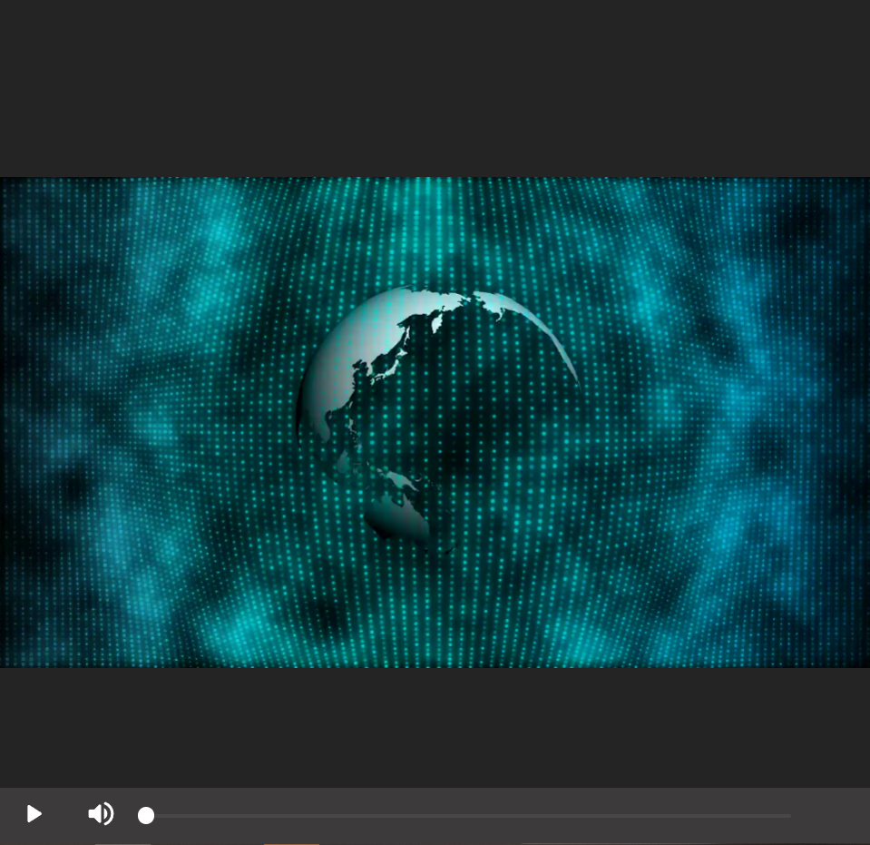
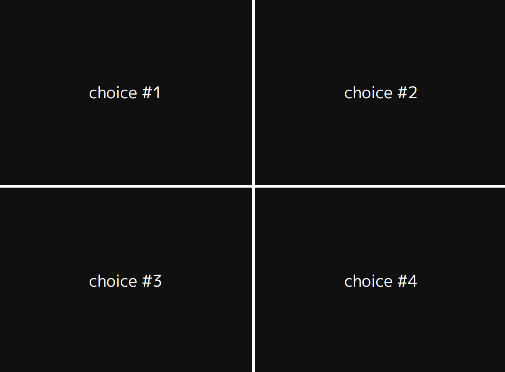

# Summary

- [Summary](#summary)
- [Interactive-video-player](#interactive-video-player)
  - [Description](#description)
  - [Installation](#installation)
  - [Usage Exemple](#usage-exemple)
  - [Documentation](#ducumentation)
    - [Events](#events)
    - [Player](#player)
    - [Project](#project)
    - [Video](#video)
    - [Controller](#controller)
    - [PopUp](#popup)
  - [Examples](#examples)

# Interactive-video-player

This project is licensed under [ISC](https://en.wikipedia.org/wiki/ISC_license).

## Description

The `interactive-video-player` package is a _custom component_ using _shadowDOM_ properties embedable in html. This library include a video player allowing the user to switch between multiple video sequence based on textual choicie made by the user presented to him at each ends of a video sequence.

This library allow to quickly create video games like for exemple [Super Seducer](https://store.steampowered.com/app/695920/Super_Seducer__How_to_Talk_to_Girls/) by providing a scenario object directly to the video player.

## Installation

```bash
npm i @shammas44/interactive-video-player
```

## Usage Exemple

First import the `Player` class in your script to make the `shammas-player` custom element available.

```typescript
// index.ts

// imports Players types
import {
  Player as PlayerElement,
  Project,
  VideoNode
} from "@shammas44/interactive-video-player";
//imports the web component called shammas-player
import from "@shammas44/interactive-video-player";
```

Then include it in your html using the `shammas-player` custom element tag

```html
<!-- index.html -->
<!DOCTYPE html>
<html lang="en">
<head>
  <meta name="viewport" content="width=device-width, initial-scale=1" />
  <script defer type="module" src="index.ts"></script>
</head>
<body>
  <!-- insert your video player -->
  <shammas-player></shammas-player>
</body>
</html>
```

It is important to use the following meta tag in your html document to make `@media query` work as expected

```html
<meta name="viewport" content="width=device-width, initial-scale=1" />
```

To configure your player you need to call the method `initProject` with a valid project from `Project` type as argument

```typescript
// index.ts

// The preceding imports goes here ->

const videos: VideoNode[] = [
  {
    id: "1",
    name: "video1",
    paths: ["video/video1-desktop.mp4", "video/video1-mobile.mp4"],
    animation: {
      title: "Which Video sequence would you watch now ?",
      duration: 10,
      position: InteractionPosition.BOTTOM,
    },
    interactions: [
      { id: "2", content: "video 2" },
      { id: "3", content: "video 3" },
    ],
  },
  {
    id: "2",
    name: "video2",
    paths: ["video/video2-desktop.mp4", "video/video2-mobile.mp4"],
    animation: {
      title: "Which Video sequence would you watch now ?",
      duration: 10,
      position: InteractionPosition.BOTTOM,
    },
  },
  {
    id: "3",
    name: "",
    paths: ["money.mp4", "money.mp4"],
  },
];

const project: Project = {
  id: "1",
  entrypointId: "1",
  videos: videos,
};

const player: PlayerElement | null = document.querySelector("shammas-player");
if (player != null) {
  player.initProject(project);
}
```

## Documentation

### Events

`shammas-video-end`: Fired when the last video sequence just finished playing

`shammas-sequence-started`: Fired once a new video sequence is played

This events emits The current video of type `VideoNode` available on property `detail`

__Exemple__

```typescript
const player: PlayerElement | null = document.querySelector("shammas-player");
if (player != null) {
  player.addEventListener('shammas-sequence-started',(e)=>{
    // log out the current video of type VideoNode
    console.log(e.detail) 
  });
  player.initProject(project);
}
```

⚠️  It is important to set the eventListener before calling `player.initProject()` otherwise, the first video sequence won't be taken into account.

`shammas-lastSequenceReached`: Fired when the last video of the sequence start playing.

### Player

`Selectors`: defines CSS selectors that are used in the player.

`VideoEvent`: defines strings that represent the different types of events that can be triggered when interacting with a video element.

`MouseEvents`: defines strings that represent the different types of mouse events that can be triggered.

`ProgressBarEvents`: defines a single event type `INPUT` that can be triggered when interacting with the progress bar element.

`Icons`: defines URLs for different icons used in the UI, and they come from an icon library.

#### Methods

The `initProject` method takes a `Project` object, a boolean value indicating whether the player is running on a mobile device (`isMobile`), and an optional `firstVideoId` parameter. This method initializes the `project` property and calls the `init` method on the `videoPlayers` object, passing in the `project` and the `Player` object. If a `firstVideoId` is provided, the player will start playing that video; otherwise, it will start playing the entrypoint video specified in the `project` object.

The `playVideo` method takes a `videoId` string and a boolean indicating whether the player is running on a mobile device (`isMobile`). This method calls the `play`method on the`videoPlayers`object, passing in the`videoId`, `false`, and `isMobile` parameters.

The `togglePlay` method toggles the play/pause state of the currently playing video and updates the `controller` button play icon accordingly.

### Project

`Interaction`: represents an interaction that can be associated with a video node. It has two properties: `content`, which is a string representing the content of the interaction, and `id`, which is a unique string identifier for the interaction.

`VideoNode`: represents a node in a video graph. It has three properties:

- `id`, which is a unique string identifier for the node,
- `name`, which is a string representing the name of the node
- `paths`, which is an array of two strings and the first one is used for stocking the source of the video landscape format, and the seconde one is for the mobile format .
- Additionally, it can have an optional `interactions` property, which is an array of `Interaction` objects associated with the node.

`Project`: represents a project involving multiple video nodes. It has three properties: `id`, which is a unique string identifier for the project, `entrypointId`, which is a string representing the ID of the entrypoint node for the project, and `videos`, which is an array of `VideoNode` objects representing the nodes in the video graph.

### Video

The `Video` class has a constructor that sets up some instance variables and event listeners, and it also has several methods that manage video playback and event handling.

The `init` method initializes the video player with a `Project` object and a `Player` object. The `play` method plays a video with the specified ID, and takes a boolean `firstPlay` parameter which is true if this is the first video being played, and a boolean `isMobile` parameter which is true if the player is running on a mobile device.

The `getCurrentVideoTag` method returns the current HTML `video` element being played.

### Controller

The `Controller` class represents a custom web component for controlling the video playback.

The class has several properties and methods:

* `currentVideoTagIndex`: a number representing the index of the currently selected video tag.
* `videoTags`: a list of video elements.
* `toggleButton`, `volumeButton`, and `progressBar`: references to various elements within the component.
* `hideTimeout`: a NodeJS timeout object used to hide the controller after a certain period of inactivity.
* `setCurrentVideoTagIndex(index: number)`: a method for setting the index of the currently selected video tag.

Finally, the code defines the custom element using the `customElements.define()` method, which registers the `Controller` class with the browser so that it can be used as an HTML tag. The `COMPONENT_NAME` constant (`N`) is used to specify the name of the custom element.

### PopUp

The `Popup` class is used to create a custom HTML element with the name "popup". It imports several modules and constants from other files, including `Interaction` and `VideoNode` from `../../models/project`, `Selectors` and `MouseEvents` from `../../models/player`, and `COMPONENT_NAME` from `../../utils/helpers`. It also imports a default export named `template` from a file called `popup.template` and `Video` from `../video/video`.

The `buildPopup` method takes a `VideoNode` object as an argument and builds the popup content based on the interactions associated with that video.

The `togglePopup` method toggles the visibility of the popup and sets up a listener for a click event on the popup button. Finally, the `createButtons` and `createButton` methods are used to create and add buttons to the popup based on the interactions associated with the video.

## Examples

A quick view of what the player looks like:



It's a player where the user can

- stop/play the video;
- mute/unmute the video;
- move forward and backward in the current video.

A quick view of what the interactions

```json
...

"interactions": [
	{
		"id": "id-choice-1",
		"content": "choice #1"
	},
	{
		"id": "id-choice-2",
		"content": "choice #2"
	},
	{
		"id": "id-choice-3",
		"content": "choice #3"
	},
	{
		"id": "id-choice-4",
		"content": "choice #4"
	}

...
```

look like (they appear in the form of a popup):



When the user cliks in one of the options, it defines wich video plays next.
